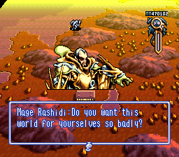
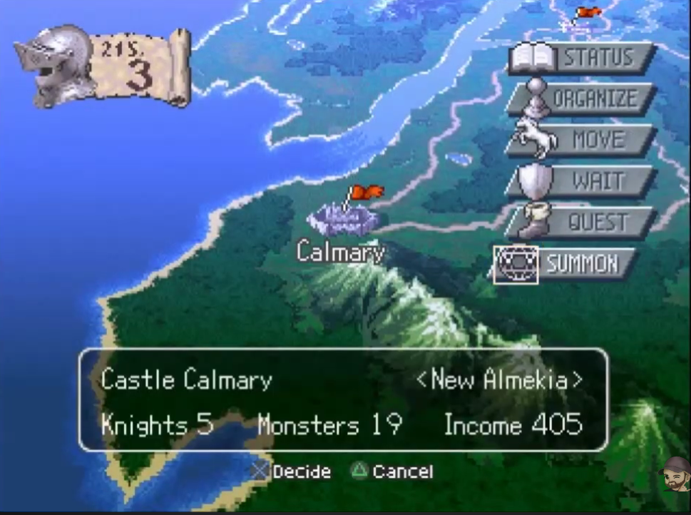

# Battle UI — Brigandine Direction

This cycle, opened 2026-09-15, turns the current hex-battle HUD exploration into a coherent, playable interface direction. The target is a Brigandine-inspired command rail paired with restrained unit inspection: a click selects a unit and opens a compact readout, hover gives a light silhouette cue, status effects remain visible without covering the board, and a dedicated STATUS surface carries the full character sheet. The current Nogg frame language remains the frame for information windows; this cycle does not replace it, invent item or equipment rules, or port the design back to the square battle scene.

## Reference images

The attached screenshots are visual references, not executable instructions. The user request and the constraints in this cycle decide the implementation. The copies below are committed with the plan so a future session does not depend on temporary clipboard paths.

### Dialogue and explanation reference

Saved at `docs/plans/references/battle-ui/brigandine-dialog.png`.

Use this image to judge when a sentence-level text box is appropriate: dialogue, confirmation, a selected spell or status explanation, and a clear unavailable-action reason. Do not use this treatment for routine hover telemetry, a permanent unit nameplate, damage ticks, or status-duration updates.

### Command stack reference

Saved at `docs/plans/references/battle-ui/brigandine-command-stack.png`.

This is the golden source of truth for the command presentation: individual slanted plates, an icon and label per action, a stable edge rail, and a small contextual information window when the focused choice needs explanation. The default placement for the hex battle is the right edge. It must not jump from side to side based on the unit under the cursor; a future left-handed layout can be a separate preset after playtesting.

The existing project frame asset, `assets/ui/briganborders.png`, and the `NoggWindow`/`NoggTheme` family remain the source for framed readouts and detail windows. The Brigandine screenshot informs geometry and hierarchy, not a request to replace the project's frame art.

## Design decisions this cycle must settle

- **Hover:** the default hover signal is a quiet white silhouette outline, approximately 2–3 px at the projected unit contour. It should be readable over the map without competing with the command rail. A name label above the monster is optional only if the Opus session finds a clear accessibility reason; it is not the default.
- **Click/select:** selection is the explicit point at which the unit readout appears. It shows the unit name, level, HP bar and numeric HP, and an element square containing a placeholder color and a two-digit element code. The selected unit also receives a persistent marker distinct from the hover outline.
- **Status effects:** a compact icon row may sit above the unit, using the existing status badge/icon presentation where possible. The selected readout exposes effect names and remaining durations. Focusing or hovering an individual effect opens a short explanation surface. Overflow must remain inspectable without piling icons across the board.
- **Command rail:** use individual Brigandine-like plates instead of one enclosing command box. Keep the rail in a stable right-side safe area. Focus, disabled state, and the current phase should be communicated by plate state, cursor, and a short explanation surface; never use the rejected labels `Details`, `MOVE ready`, or `ACTION ready`.
- **Detail surfaces:** `STATUS` opens a full character sheet with a portrait/model placeholder, name, level, HP, elements, race, characteristics, active effects, spells, passives, and up to three equipment slots. Spells and items may be presented as disabled or placeholder surfaces until their gameplay contracts exist. The UI must not invent inventory or equipment behavior.
- **Text boxes:** reserve the first screenshot's framed text treatment for dialogue, confirmation, selected spell/status explanations, and unavailable-action reasons. Routine selection, hover, status ticks, and damage feedback stay compact and non-modal.

## Invariants and boundaries

- `BattleSimulator` and `BattleState` remain canonical. Presentation observes through existing battle events and visual-adapter boundaries and never mutates battle state directly.
- Deterministic `uniqueID` values remain the identity used by selection and inspection. Do not use `get_instance_id()` for gameplay identity.
- Status duration changes continue to be owned by the battle turn flow. The HUD only reads the current facts.
- The approved hex command semantics remain intact: move/attack aim flows, spell rows and paging, undo move, end turn, and end-party behavior continue to route through the existing input/controller path.
- Reuse `StatusBadgeRow.gd` and `StatusEffectIcons.gd` as compatibility surfaces. Do not retune or generalize them just to make this HUD fit; edit them only in a separately scoped migration after every caller has been enumerated and visually checked.
- Keep the existing `NoggWindow` frame, halo, cursor, bitmap-font, and skin conventions. New plate tokens belong in the theme/catalog layer rather than as presentation color literals.
- No new portrait, monster portrait, or icon art is required for this cycle. Use explicit placeholders that can be replaced by content data later.
- The existing square battle reference is frozen. This cycle targets the hex battle presentation only.

## Work items

### BUI-1 — Establish the battle HUD interaction contract

**Model:** Opus 5 / GPT Sol
**Model rationale:** This item crosses the input/controller and presentation boundary while the desired interaction vocabulary is still unsettled. Opus must decide which facts are exposed as typed view data and which remain presentation-local without duplicating eligibility rules or changing the simulator contract.

**Depends on:** —

**Touches:**

- `src/systems/hex_battle/HexBattleController.gd`
- `src/systems/hex_battle/HexBattleMemberInput.gd`
- `docs/UI_DESIGN.md`
- `docs/ARCHITECTURE.md`

**End state:** The controller/input boundary exposes a small, explicit contract for selected/hovered unit facts, command availability and its explanation, status inspection requests, and opening the STATUS surface. Existing command IDs, turn order, targeting rules, and simulator ownership remain unchanged. The design docs record the contract and the decision that removes the rejected readiness labels.

**Implementation brief:** First trace the current `menu_changed`, `status_changed`, dismissal, picking, and command-confirmation flow. Choose the smallest signal/view-model boundary that lets the HUD render the requested facts without reaching into `BattleState`. Decide whether hover ownership belongs in the HUD or visual adapter, then make one owner explicit. Treat `STATUS` as a presentation request unless the existing command model already has a canonical equivalent. Keep item/equipment data read-only or placeholder. Record the chosen shape, rejected alternatives, and why in the commit body.

**Risk:** A tempting shortcut is to let controls query or mutate battle state, or to derive command eligibility twice. Either would make later UI work appear correct while desynchronizing the battle. Another risk is adding a new gameplay command for a presentation-only sheet.

**Validation:**

- **Self-contained:** run `git diff --check -- src/systems/hex_battle/HexBattleController.gd src/systems/hex_battle/HexBattleMemberInput.gd docs/UI_DESIGN.md docs/ARCHITECTURE.md`; inspect the touched signals/types for direct state mutation, `get_instance_id()`, and the strings `Details`, `MOVE ready`, and `ACTION ready`; run the repository's headless Godot editor load probe against the touched scripts/scenes.
- **Deferred:** none for this contract item; visual acceptance is consolidated in BUI-4.

### BUI-2 — Build the Brigandine command rail

**Model:** Opus 5 / GPT Sol
**Model rationale:** The rail is a visual and interaction decision with competing constraints: Brigandine's strong stacked plates, the project's existing window skin, keyboard/pointer focus, and the current hex command model. Opus must make the hierarchy and focus behavior coherent rather than mechanically restyling the present rows.

**Depends on:** BUI-1

**Touches:**

- `src/presentation/battle/ui/HexCommandMenu.gd`
- `src/presentation/battle/ui/HexCommandPlate.gd*`
- `src/presentation/theme/NoggTheme.gd`
- `src/presentation/theme/HudLayoutCatalog.gd`

**End state:** The command menu is a stable right-edge rail of separate slanted plates with icon, label, focus cursor, enabled/disabled state, and clear ordering. It maps to the existing move/attack/spell/undo/end-turn/end-party semantics and exposes a presentation-only STATUS entry. Child spell/item choices open inward in framed windows and return focus predictably. No enclosing command box or readiness copy remains.

**Implementation brief:** Inspect the current `HexCommandMenu` row model and the Brigandine reference at `docs/plans/references/battle-ui/brigandine-command-stack.png`. Decide how the plate geometry, icon treatment, selected state, disabled state, and safe-area anchor fit the existing `NoggTheme`, `MenuCursor`, and bitmap fonts. Keep the rail fixed during a turn; do not reposition it around actors. Preserve controller-facing signals and command IDs while adding only the presentation signal needed to open STATUS. Put reusable measurements and colors in the theme/layout catalogs. Record why the final order and focus model were chosen.

**Risk:** A restyle can accidentally change input routing, consume confirmation twice, or make a disabled action look selectable. A shared theme edit can also regress unrelated HUDs; keep the token change additive and check its callers.

**Validation:**

- **Self-contained:** verify the command-ID-to-label mapping, focus traversal, and signal signatures with a narrow script/load probe; run `git diff --check -- src/presentation/battle/ui/HexCommandMenu.gd src/presentation/battle/ui/HexCommandPlate.gd src/presentation/theme/NoggTheme.gd src/presentation/theme/HudLayoutCatalog.gd` and grep the touched paths for the rejected readiness labels.
- **Deferred:** launch the hex battle and inspect keyboard, mouse, cancel, disabled, child-menu, and STATUS focus behavior at the intended viewport sizes; record the tested revision and any unrelated in-flight edits in the validation commit.

### BUI-3 — Add unit inspection, status effects, and character surfaces

**Model:** Opus 5 / GPT Sol
**Model rationale:** This item is a cross-surface visual composition problem. It must balance board visibility, projected world anchors, status-icon density, modal detail windows, placeholder content, and stale-selection handling while integrating two existing shared status components without regressing their other callers.

**Depends on:** BUI-1, BUI-2

**Touches:**

- `src/presentation/battle/HexBattleHud.gd`
- `src/presentation/battle/HexBattleVisualAdapter.gd`
- `src/presentation/battle/ui/HexUnitReadout.gd*`
- `src/presentation/battle/ui/HexCharacterStatus.gd*`
- `src/presentation/battle/ui/HexStatusExplanation.gd*`
- `src/presentation/battle/ui/HexSpellMenu.gd*`
- `src/presentation/battle/ui/HexItemMenu.gd*`

**End state:** Hovering a unit produces the white silhouette cue; clicking selects it and opens the compact name/level/HP/element readout. The selected unit has a persistent marker. Status icons can be shown above units without obscuring the map, and selected effects expose names/durations with an explanation surface on focus. STATUS opens the framed character sheet with portrait/model placeholder, taxonomy and characteristics, element, HP, effects, spells, passives, and three equipment slots. Spell and item menus can show real available data where it already exists and otherwise use clearly disabled placeholders. Routine damage/status updates do not become dialog boxes.

**Implementation brief:** Choose a projection/overlay strategy that follows the existing `HexBattleVisualAdapter` and camera without changing models or shared VFX. Reuse `StatusBadgeRow.gd` and `StatusEffectIcons.gd` unchanged unless a concrete integration defect is proven; if a change is unavoidable, stop and split that migration into a new plan item before editing. Define how selection survives camera movement, unit death, paging, cancel, and end-party transitions. Keep placeholder portrait/equipment cells data-driven and visually replaceable. Use the existing Nogg frame for readouts and sentence-level explanations. Record the visual density tradeoffs and stale-data handling in the commit body.

**Risk:** Projected controls can drift from units, overlap the command rail, or leave a stale readout after a unit disappears. Status rows can become unreadable when many effects are active. The sheet can also imply gameplay that does not yet exist if disabled item/equipment states are not explicit.

**Validation:**

- **Self-contained:** verify selected-unit and active-effect mappings by deterministic `uniqueID`, duration display and overflow behavior; run `git diff --check` for every touched path and a headless Godot load probe for the new controls and HUD scene.
- **Deferred:** manually exercise hover versus click, camera movement, unit death, status overflow, effect explanation, STATUS tabs, spell paging, placeholder items/equipment, cancel/back, and end-party in the hex battle; compare the hierarchy against both saved references and record the revision/context in BUI-4.

### BUI-4 — Integrated visual and interaction validation

**Model:** Opus 5 / GPT Sol
**Model rationale:** Acceptance depends on fresh visual judgement across the complete flow, not on a local script check. Opus must assess whether the rail, outline, status treatment, and text-box moments read as one interface and may make narrowly scoped fixes when an observable defect is found.

**Depends on:** BUI-1, BUI-2, BUI-3

**Touches:**

- `src/systems/hex_battle/HexBattleController.gd`
- `src/systems/hex_battle/HexBattleMemberInput.gd`
- `src/presentation/battle/ui/HexCommandMenu.gd`
- `src/presentation/battle/ui/HexCommandPlate.gd*`
- `src/presentation/theme/NoggTheme.gd`
- `src/presentation/theme/HudLayoutCatalog.gd`
- `src/presentation/battle/HexBattleHud.gd`
- `src/presentation/battle/HexBattleVisualAdapter.gd`
- `src/presentation/battle/ui/HexUnitReadout.gd*`
- `src/presentation/battle/ui/HexCharacterStatus.gd*`
- `src/presentation/battle/ui/HexStatusExplanation.gd*`
- `src/presentation/battle/ui/HexSpellMenu.gd*`
- `src/presentation/battle/ui/HexItemMenu.gd*`

**End state:** The integrated hex-battle flow is visually and behaviorally reviewable: command focus is predictable, hover is quiet, click selection is informative, statuses are inspectable, STATUS is complete enough to guide future content replacement, and text boxes appear only for sentence-level communication. Any fix made here stays within the listed paths and preserves the invariants above.

**Implementation brief:** Run the game on the current shared tree after BUI-1 through BUI-3 are committed. Test a player turn with keyboard and pointer, hover and click several monsters, inspect a unit with multiple effects, open/close STATUS, page spells, view disabled item/equipment placeholders, cancel nested menus, and end the party. Check at least one alternate viewport size and a camera movement. Compare the result with the saved references at `docs/plans/references/battle-ui/brigandine-dialog.png` and `docs/plans/references/battle-ui/brigandine-command-stack.png`. If a defect is found, fix only the owned paths, rerun the affected flow, and document both the failure and the correction in the commit body. Do not retune donor VFX or shared status components in this validation item.

**Risk:** Visual judgement can be masked by unrelated in-flight scene or asset edits. Record the tested revision and those unrelated changes so a failure is not attributed to the UI cycle without evidence.

**Validation:**

- **Self-contained:** rerun `git diff --check` on the complete Touches list, the headless Godot load probe, and the label/identity grep audits from the earlier items.
- **Deferred:** this is the standalone visual validation item. Record the exact revision, viewport sizes, flows exercised, reference-image comparison, and any narrowly scoped fix in the commit body. The item remains `implemented; pending validation` until this commit exists; after it passes, the cycle is verified.

## Waves and validation shape

| Wave | Items | Why disjoint |
|------|-------|--------------|
| 1 | BUI-1 | Establishes the controller/input contract before presentation work. |
| 2 | BUI-2 | Owns the command menu, plate control, and shared theme/layout tokens. |
| 3 | BUI-3 | Owns the HUD/visual-adapter integration and all inspection/detail controls after the command signal contract exists. |
| 4 | BUI-4 | Standalone validation is required because acceptance includes appearance, hierarchy, and cross-flow interaction judgement. |

**Where validation runs:** standalone, in Wave 4. The final acceptance is a fresh-eyes judgement of visual hierarchy and interaction feel, so it must not be folded into the implementing session.

## Explicitly out of scope

- New battle rules for inventory, equipment, defend, or items.
- New portrait, monster, status, or command art production.
- Replacing `NoggWindow`, `NoggTheme`, `briganborders.png`, or shared status components with a parallel skin.
- A permanent nameplate above every monster.
- A command rail that relocates itself per actor or per hover.
- Porting this hex-battle treatment back into the square battle scene.
